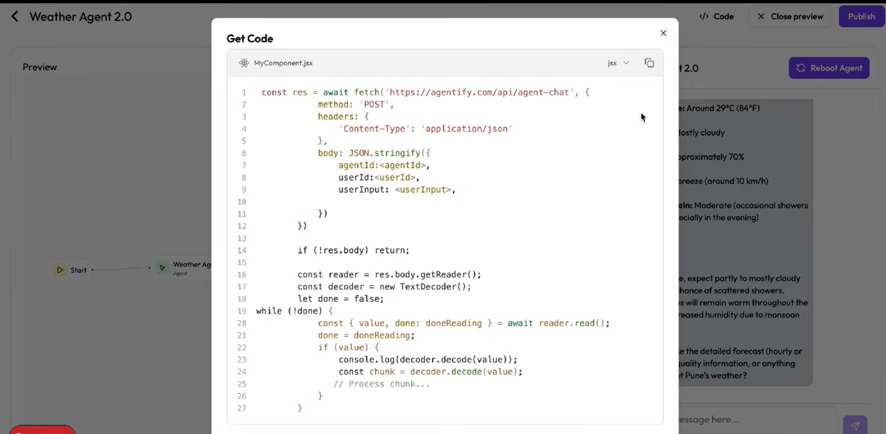

# 🤖 AI‑Agent — Multi‑Agent AI Builder with Streaming Chat

> **AI‑Agent** is a powerful **multi‑agent orchestration platform** built with **Next.js 14** and the **OpenAI Agents SDK**. It allows users to **design AI agents, attach tools, orchestrate agent handoffs, and chat with them in real‑time using streaming responses** — similar to ChatGPT, but fully customizable.

🔗 **GitHub Repository:** [https://github.com/Abhishek-3191/AI-Agent](https://github.com/Abhishek-3191/AI-Agent)

---
## 📸 Screenshots

### Agent Builder UI


### Streaming Chat


## ✨ Why This Project Is Impressive

This project is not a basic chatbot. It demonstrates **advanced backend + frontend concepts** used in real AI products:

* 🧠 **Multi‑Agent Architecture** (agent handoffs & routing)
* 🌊 **Token‑level Streaming Responses** (ReadableStream)
* 🛠️ **Dynamic Tool Creation** with runtime validation
* 🔄 **Conversation Memory** via conversationId
* ⚡ **Low‑latency UI updates** (ChatGPT‑like experience)

Perfect for:

* AI platform startups
* Agentic AI experiments
* Resume / interview system‑design discussions

---

## 🚀 Features

### ✅ Core Features

* **Agent Builder UI** – Create agents with custom instructions
* **Multi‑Agent Handoffs** – Parent agent decides which agent to invoke
* **Streaming Chat** – Real‑time token streaming to frontend
* **Conversation Persistence** – Context maintained across messages
* **Preview Mode** – Test agents before deployment

### ⚡ Advanced Features

* **Dynamic Tool Generation**

  * Tools defined by users
  * Parameters validated using **Zod**
* **External API Tool Calling**

  * Tools can call real APIs with query injection
* **ReadableStream Handling**

  * Backend streams chunks
  * Frontend appends tokens progressively
* **Fast Refresh Safe Architecture**

  * Avoids request body reuse errors

---

## 🧱 Tech Stack

### Frontend

* **Next.js 14 (App Router)**
* **React + TypeScript**
* **Tailwind CSS**
* **Shadcn/UI**

### Backend

* **OpenAI Agents SDK (`@openai/agents`)**
* **Streaming Responses (ReadableStream)**
* **Zod** – Schema & parameter validation

---

## 📦 Setup & Installation

### 1️⃣ Clone the Repository

```bash
git clone https://github.com/Abhishek-3191/AI-Agent.git
cd AI-Agent
```

### 2️⃣ Install Dependencies

```bash
npm install
```

### 3️⃣ Environment Variables

Create a `.env.local` file in the root directory:

```env
OPENAI_API_KEY=your_openai_api_key
```

> ⚠️ Make sure your OpenAI key has access to the **Agents API**.

### 4️⃣ Run Development Server

```bash
npm run dev
```

Open in browser:
👉 **[http://localhost:3000](http://localhost:3000)**

---

## 🔌 API Endpoints

### `POST /api/agent-chat`

Streams AI responses.

**Request Body**

```json
{
  "agentName": "Weather Agent",
  "agents": [],
  "tools": [],
  "input": "hello",
  "conversationId": "conv_xxx"
}
```

**Response**

* `text/plain`
* Streaming tokens

---

### `GET /api/agent-chat`

Creates a new conversation.

**Response**

```json
"conv_xxxxxxxxx"
```

---

## 🌊 Streaming Flow (How It Works)

### Backend

1. Receives user input
2. Runs the parent agent
3. Delegates to sub‑agents if needed
4. Streams tokens using `toTextStream()`

### Frontend

```ts
const reader = res.body.getReader();
const decoder = new TextDecoder();

while (true) {
  const { value, done } = await reader.read();
  if (done) break;

  const chunk = decoder.decode(value);
  setMessages(prev => {
    const updated = [...prev];
    updated[updated.length - 1].content += chunk;
    return updated;
  });
}
```
---

## 🧠 Agent Orchestration Design

```
User Query
   ↓
Main Agent (Router)
   ↓
Chooses Best Sub‑Agent
   ↓
Optional Tool Calls
   ↓
Streaming Response → UI
```

---

## 🧪 Common Errors & Fixes

### ❌ `Body is unusable: Body has already been read`

✔ Caused by reading request body more than once
✔ Fix: Call `await req.json()` **only once**

### ❌ Blank response on frontend

✔ Backend not returning stream
✔ Ensure: `return new Response(stream)`

### ❌ Fast Refresh full reload

✔ Happens during streaming runtime errors
✔ Safe during development

---

## 📈 Future Enhancements

* 🔐 Authentication (Clerk / NextAuth)
* 🧠 Long‑term memory (Vector DB)
* 🧩 Agent template marketplace
* 📊 Conversation analytics
* ☁️ Vercel deployment

---

## 📌 Resume‑Ready Description

> Built a **multi‑agent AI platform** using **Next.js and OpenAI Agents SDK**, supporting real‑time streaming chat, dynamic tool calling, and agent orchestration with conversation memory.

---

## ⭐ Author

**Abhishek Srivastava**
🔗 [https://github.com/Abhishek-3191](https://github.com/Abhishek-3191)

---

If you like this project, don’t forget to ⭐ the repo!
